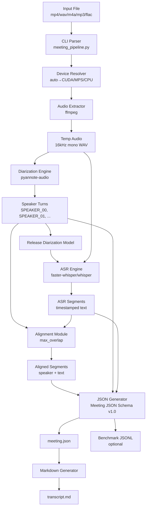

# Design Document: Meeting Speaker Diarization Pipeline

## Overview

このシステムは、会議の音声・動画ファイルから話者分離（Speaker Diarization）と自動音声認識（ASR）を実行し、話者ラベル付きの議事録を生成するパイプラインです。

### 設計の重点

1. **クロスプラットフォーム対応**: Windows（CUDA）、macOS（MPS/CPU）で同一のCLIを提供
2. **メモリ効率**: 話者分離とASRを順次実行し、GPU/CPUメモリの圧迫を回避
3. **堅牢性**: 話者割当できない区間をUNKNOWNとして保持し、データ損失を防止
4. **拡張性**: JSON Schema v1.0による構造化データで、将来のGUI化や精度改善に対応
5. **再現性**: モデル名、パラメータ、処理時間を完全に記録

### 主要な技術選択

- **話者分離**: pyannote-audio（Hugging Faceモデル）
- **ASR**: faster-whisper（優先）、whisper（オプション）
- **音声処理**: ffmpeg（抽出・変換）
- **出力形式**: JSON（機械処理用）、Markdown（人間可読）

### 段階的開発アプローチ

- **Phase 1**: Windows + CUDA環境でJSON出力まで実装
- **Phase 2**: Markdown生成を追加し、運用可能化
- **Phase 3**: 単語/句単位アライン（精度向上）
- **Phase 4**: macOS対応（MPS/CPU）

## Architecture

### システムアーキテクチャ



### コンポーネント構成

システムは以下の独立したコンポーネントで構成されます：

1. **CLI Parser**: コマンドライン引数を解析し、パイプライン設定を構築
2. **Device Resolver**: 利用可能なデバイス（CUDA/MPS/CPU）を検出・選択
3. **Audio Extractor**: 入力ファイルから16kHz mono WAVを抽出
4. **Diarization Engine**: 話者分離を実行し、Speaker Turnsを生成
5. **ASR Engine**: 音声認識を実行し、ASR Segmentsを生成
6. **Alignment Module**: Speaker TurnsとASR Segmentsを突合し、話者ラベルを割当
7. **JSON Generator**: Meeting JSON Schema v1.0形式で統合ログを生成
8. **Markdown Generator**: JSONから人間可読なMarkdownを生成
9. **Benchmark Logger**: 性能測定データをJSONL形式で記録（オプション）

### データフロー

1. **入力段階**: 動画/音声ファイル → 16kHz mono WAV
2. **分析段階**: WAV → 話者分離 → Speaker Turns
3. **認識段階**: WAV → ASR → ASR Segments
4. **統合段階**: Speaker Turns + ASR Segments → Alignment → Aligned Segments
5. **出力段階**: Aligned Segments → JSON + Markdown

### 処理の順序性（重要）

メモリ効率のため、以下の順序を厳守します：

1. Diarization Engineを実行
2. Diarization Engineのモデル参照を解放
3. ASR Engineを実行
4. Alignmentを実行

並列実行は行いません。

## Components and Interfaces

### 1. CLI Parser

**責務**: コマンドライン引数の解析と検証

**インターフェース**:
```python
class PipelineConfig:
    input_file: str
    device: str  # auto|cuda|mps|cpu
    enable_diarization: bool
    diar_model: str
    asr_engine: str  # faster-whisper|whisper
    asr_model: str  # tiny|base|small|medium|large
    language: str
    beam_size: int
    best_of: int
    vad_filter: bool
    output_dir: str
    temp_dir: str
    keep_audio: bool
    format: str  # json|md|both
    bench_jsonl: Optional[str]
    run_id: Optional[str]
    note: Optional[str]

def parse_args() -> PipelineConfig:
    """Parse command line arguments and return configuration."""
    pass
```

**主要な検証**:
- 入力ファイルの存在確認
- デバイス指定の妥当性
- 出力ディレクトリの作成可能性

### 2. Device Resolver

**責務**: 実行環境に応じた最適なデバイスの選択

**インターフェース**:
```python
class DeviceInfo:
    requested: str
    resolved: str  # cuda|mps|cpu

def resolve_device(requested: str) -> DeviceInfo:
    """
    Resolve device based on availability.
    Priority: CUDA > MPS > CPU (when requested='auto')
    """
    pass
```

**解決ロジック**:
- `auto`: CUDA → MPS → CPU の優先順
- `cuda`: CUDAが利用可能か確認、不可ならエラー
- `mps`: MPSが利用可能か確認、不可ならエラー
- `cpu`: 常に成功

### 3. Audio Extractor

**責務**: 入力ファイルから標準化された音声ファイルを抽出

**インターフェース**:
```python
class AudioInfo:
    path: str
    sample_rate: int
    channels: int
    duration_sec: float

def extract_audio(
    input_file: str,
    temp_dir: str,
    keep_audio: bool
) -> AudioInfo:
    """
    Extract audio from input file using ffmpeg.
    Output: 16kHz, mono, pcm_s16le WAV
    """
    pass
```

**ffmpegコマンド例**:
```bash
ffmpeg -i input.mp4 -ar 16000 -ac 1 -c:a pcm_s16le output.wav
```

**エラーハンドリング**:
- ffmpegが利用不可の場合、明確なエラーメッセージ
- 入力ファイルが読めない場合、ファイルパスを含むエラー

### 4. Diarization Engine

**責務**: 話者分離の実行とSpeaker Turnsの生成

**インターフェース**:
```python
class SpeakerTurn:
    id: str  # turn_000001, turn_000002, ...
    speaker_id: str  # SPEAKER_00, SPEAKER_01, ...
    start: float
    end: float

class DiarizationResult:
    turns: List[SpeakerTurn]
    speakers: List[str]  # [SPEAKER_00, SPEAKER_01, ...]
    model: str
    engine: str
    hf_token_used: bool

def run_diarization(
    audio_path: str,
    device: str,
    model: str
) -> DiarizationResult:
    """
    Run speaker diarization using pyannote-audio.
    Requires HF_TOKEN in environment.
    """
    pass
```

**実装の詳細**:
- pyannote-audioのPipelineを使用
- HF_TOKENが環境変数に存在しない場合、即座にエラー
- 話者数は動的（2人固定にしない）
- 話者IDは出現順にSPEAKER_00, SPEAKER_01, ...と割り当て

### 5. ASR Engine

**責務**: 音声認識の実行とASR Segmentsの生成

**インターフェース**:
```python
class ASRSegment:
    id: str  # asr_000001, asr_000002, ...
    start: float
    end: float
    text: str

class ASRResult:
    segments: List[ASRSegment]
    model: str
    engine: str
    device: str
    compute_type: str
    language: str
    beam_size: int
    best_of: int
    vad_filter: bool

def run_asr(
    audio_path: str,
    device: str,
    config: PipelineConfig
) -> ASRResult:
    """
    Run ASR using faster-whisper or whisper.
    """
    pass
```

**faster-whisper実装**:
```python
from faster_whisper import WhisperModel

model = WhisperModel(
    model_size_or_path=config.asr_model,
    device=device,
    compute_type="float16" if device in ["cuda", "mps"] else "int8"
)

segments, info = model.transcribe(
    audio_path,
    language=config.language,
    beam_size=config.beam_size,
    best_of=config.best_of,
    vad_filter=config.vad_filter
)
```

**whisper実装**（Phase 1では分岐のみ用意）:
```python
import whisper

model = whisper.load_model(config.asr_model, device=device)
result = model.transcribe(
    audio_path,
    language=config.language,
    beam_size=config.beam_size,
    best_of=config.best_of
)
```

### 6. Alignment Module

**責務**: Speaker TurnsとASR Segmentsの突合による話者ラベル割当

**インターフェース**:
```python
class AlignedSegment:
    id: str  # seg_000001, seg_000002, ...
    start: float
    end: float
    speaker_id: str
    speaker_label: str
    text: str
    confidence: Optional[float]
    source: SegmentSource

class SegmentSource:
    asr_segment_id: str
    diarization_turn_id: Optional[str]
    overlap_sec: float

def align_segments(
    asr_segments: List[ASRSegment],
    speaker_turns: List[SpeakerTurn],
    method: str = "max_overlap"
) -> List[AlignedSegment]:
    """
    Align ASR segments with speaker turns.
    """
    pass
```

**max_overlapアルゴリズム**:

```python
def calculate_overlap(seg_start, seg_end, turn_start, turn_end):
    """Calculate temporal overlap in seconds."""
    overlap_start = max(seg_start, turn_start)
    overlap_end = min(seg_end, turn_end)
    return max(0, overlap_end - overlap_start)

for asr_seg in asr_segments:
    max_overlap = 0
    best_turn = None
    
    for turn in speaker_turns:
        overlap = calculate_overlap(
            asr_seg.start, asr_seg.end,
            turn.start, turn.end
        )
        if overlap > max_overlap:
            max_overlap = overlap
            best_turn = turn
    
    if max_overlap > 0:
        speaker_id = best_turn.speaker_id
        turn_id = best_turn.id
    else:
        speaker_id = "UNKNOWN"
        turn_id = None
    
    aligned_segments.append(AlignedSegment(
        speaker_id=speaker_id,
        overlap_sec=max_overlap,
        diarization_turn_id=turn_id,
        ...
    ))
```

### 7. JSON Generator

**責務**: Meeting JSON Schema v1.0形式での統合ログ生成

**インターフェース**:
```python
class MeetingJSON:
    schema_version: str
    created_at: str
    title: str
    input: InputInfo
    pipeline: PipelineInfo
    speakers: List[Speaker]
    segments: List[AlignedSegment]
    artifacts: Artifacts
    timing: Timing
    notes: str

def generate_meeting_json(
    input_info: AudioInfo,
    pipeline_config: PipelineConfig,
    device_info: DeviceInfo,
    diarization_result: DiarizationResult,
    asr_result: ASRResult,
    aligned_segments: List[AlignedSegment],
    timing: Timing
) -> MeetingJSON:
    """Generate Meeting JSON from pipeline results."""
    pass

def save_meeting_json(meeting: MeetingJSON, output_path: str):
    """Serialize and save Meeting JSON to file."""
    pass
```

### 8. Markdown Generator

**責務**: JSONから人間可読なMarkdownの生成

**インターフェース**:
```python
def generate_transcript_markdown(
    meeting_json: MeetingJSON
) -> str:
    """
    Generate Markdown transcript from Meeting JSON.
    Groups segments by speaker in chronological order.
    """
    pass

def save_transcript_markdown(content: str, output_path: str):
    """Save Markdown content to file."""
    pass
```

**生成ロジック**:
1. segments配列をstart時刻でソート（既にソート済みの想定）
2. speaker_labelが変わるたびに`### {speaker_label}`見出しを挿入
3. 各セグメントを`- [HH:MM:SS - HH:MM:SS] {text}`形式で出力
4. textが空または空白のみの場合はスキップ

### 9. Benchmark Logger

**責務**: 性能測定データのJSONL形式での記録

**インターフェース**:
```python
class BenchmarkRecord:
    run_id: str
    timestamp: str
    input_file: str
    device: DeviceInfo
    models: Dict[str, str]
    timing: Timing
    note: Optional[str]

def log_benchmark(
    record: BenchmarkRecord,
    jsonl_path: str
):
    """Append benchmark record to JSONL file."""
    pass
```

## Data Models

### Meeting JSON Schema v1.0

完全なスキーマ定義：

```json
{
  "schema_version": "1.0",
  "created_at": "2026-03-04T15:30:45+09:00",
  "title": "",
  "input": {
    "path": "meeting.mp4",
    "audio": {
      "path": "temp/meeting.wav",
      "sample_rate": 16000,
      "channels": 1
    },
    "duration_sec": 5432.1
  },
  "pipeline": {
    "device": {
      "requested": "auto",
      "resolved": "cuda"
    },
    "diarization": {
      "enabled": true,
      "engine": "pyannote-audio",
      "model": "pyannote/speaker-diarization",
      "hf_token_used": true
    },
    "asr": {
      "engine": "faster-whisper",
      "model": "medium",
      "device": "cuda",
      "compute_type": "float16",
      "language": "ja",
      "beam_size": 1,
      "best_of": 1,
      "vad_filter": false
    },
    "align": {
      "method": "max_overlap",
      "unit": "asr_segment"
    }
  },
  "speakers": [
    { "id": "SPEAKER_00", "label": "Speaker 1" },
    { "id": "SPEAKER_01", "label": "Speaker 2" },
    { "id": "UNKNOWN", "label": "Unknown" }
  ],
  "segments": [
    {
      "id": "seg_000001",
      "start": 12.34,
      "end": 18.90,
      "speaker_id": "SPEAKER_00",
      "speaker_label": "Speaker 1",
      "text": "今日はこの件から始めます。",
      "confidence": null,
      "source": {
        "asr_segment_id": "asr_000104",
        "diarization_turn_id": "turn_000087",
        "overlap_sec": 6.12
      }
    }
  ],
  "artifacts": {
    "diarization_turns": [
      {
        "id": "turn_000087",
        "speaker_id": "SPEAKER_00",
        "start": 11.80,
        "end": 19.10
      }
    ],
    "asr_segments": [
      {
        "id": "asr_000104",
        "start": 12.34,
        "end": 18.90,
        "text": "今日はこの件から始めます。"
      }
    ]
  },
  "timing": {
    "extract_sec": 2.9,
    "diarization_sec": 210.3,
    "asr_load_sec": 1.8,
    "asr_sec": 127.1,
    "align_sec": 0.2,
    "summary_sec": 0.0,
    "total_sec": 360.0
  },
  "notes": ""
}
```

### Transcript Markdown Format

```markdown
# 会議ログ（話者付き）

## Transcript

### Speaker 1
- [00:12:34 - 00:12:39] 今日はこの件から始めます。
- [00:12:40 - 00:12:50] まず前提を整理します。

### Speaker 2
- [00:12:51 - 00:13:05] はい、資料を確認しました。

### Unknown
- [00:13:06 - 00:13:12] （音声が重なって聞き取りづらい）
```

### 型定義（Python）

```python
from dataclasses import dataclass
from typing import List, Optional, Dict
from datetime import datetime

@dataclass
class AudioInfo:
    path: str
    sample_rate: int
    channels: int

@dataclass
class InputInfo:
    path: str
    audio: AudioInfo
    duration_sec: float

@dataclass
class DeviceInfo:
    requested: str
    resolved: str

@dataclass
class DiarizationConfig:
    enabled: bool
    engine: str
    model: str
    hf_token_used: bool

@dataclass
class ASRConfig:
    engine: str
    model: str
    device: str
    compute_type: str
    language: str
    beam_size: int
    best_of: int
    vad_filter: bool

@dataclass
class AlignConfig:
    method: str
    unit: str

@dataclass
class PipelineInfo:
    device: DeviceInfo
    diarization: DiarizationConfig
    asr: ASRConfig
    align: AlignConfig

@dataclass
class Speaker:
    id: str
    label: str

@dataclass
class SegmentSource:
    asr_segment_id: str
    diarization_turn_id: Optional[str]
    overlap_sec: float

@dataclass
class Segment:
    id: str
    start: float
    end: float
    speaker_id: str
    speaker_label: str
    text: str
    confidence: Optional[float]
    source: SegmentSource

@dataclass
class DiarizationTurn:
    id: str
    speaker_id: str
    start: float
    end: float

@dataclass
class ASRSegment:
    id: str
    start: float
    end: float
    text: str

@dataclass
class Artifacts:
    diarization_turns: List[DiarizationTurn]
    asr_segments: List[ASRSegment]

@dataclass
class Timing:
    extract_sec: float
    diarization_sec: float
    asr_load_sec: float
    asr_sec: float
    align_sec: float
    summary_sec: float
    total_sec: float

@dataclass
class MeetingJSON:
    schema_version: str
    created_at: str
    title: str
    input: InputInfo
    pipeline: PipelineInfo
    speakers: List[Speaker]
    segments: List[Segment]
    artifacts: Artifacts
    timing: Timing
    notes: str
```


## Correctness Properties

*A property is a characteristic or behavior that should hold true across all valid executions of a system-essentially, a formal statement about what the system should do. Properties serve as the bridge between human-readable specifications and machine-verifiable correctness guarantees.*

### Property 1: Audio Extraction Format Consistency

*For any* supported input file (video or audio), the Audio_Extractor should produce output audio with sample rate of 16000 Hz, 1 channel (mono), and PCM WAV format.

**Validates: Requirements 1.1, 1.2**

### Property 2: Audio Extraction Error Handling

*For any* unsupported file format, the Pipeline should terminate with a descriptive error message indicating the format is not supported.

**Validates: Requirements 1.3**

### Property 3: Audio File Preservation

*For any* input file, when --keep-audio flag is specified, the extracted audio file should exist after pipeline completion.

**Validates: Requirements 1.4**

### Property 4: Device Selection Priority

*For any* system configuration, when --device auto is specified, the Device_Resolver should select devices in priority order: CUDA > MPS > CPU, choosing the first available device.

**Validates: Requirements 2.1**

### Property 5: Device Consistency Across Engines

*For any* pipeline execution, the resolved device should be used consistently for both Diarization_Engine and ASR_Engine.

**Validates: Requirements 2.5**

### Property 6: Speaker Turn Structure

*For any* diarization output, each Speaker_Turn record should contain speaker_id, start time, and end time fields.

**Validates: Requirements 3.3**

### Property 7: Sequential ID Assignment Pattern

*For any* pipeline execution, speaker identifiers should follow the pattern SPEAKER_00, SPEAKER_01, ..., SPEAKER_N in sequential order, and ASR segment identifiers should follow the pattern asr_000001, asr_000002, ..., asr_NNNNNN in sequential order.

**Validates: Requirements 3.4, 4.7**

### Property 8: ASR Segment Structure

*For any* ASR output, each ASR_Segment record should contain id, start time, end time, and text fields.

**Validates: Requirements 4.3**

### Property 9: ASR Engine Selection

*For any* pipeline configuration, when --asr-engine is specified, the ASR_Engine should use the implementation matching the specified engine name (faster-whisper or whisper).

**Validates: Requirements 4.1, 4.2**

### Property 10: Configuration Application

*For any* pipeline execution, the ASR_Engine should use the language and model size specified in the configuration parameters.

**Validates: Requirements 4.4, 4.5**

### Property 11: Alignment Overlap Calculation

*For any* ASR_Segment, the Alignment_Module should calculate temporal overlap with all Speaker_Turn records and assign the speaker_id with maximum overlap when overlap > 0.

**Validates: Requirements 5.1, 5.2**

### Property 12: UNKNOWN Speaker Assignment

*For any* ASR_Segment with zero overlap with all Speaker_Turn records, the Alignment_Module should assign speaker_id "UNKNOWN" and preserve the segment in all outputs (Meeting_JSON and Transcript_Markdown).

**Validates: Requirements 5.3, 15.1, 15.2, 15.3, 15.4**

### Property 13: Aligned Segment Structure

*For any* aligned segment, the record should contain segment_id, start, end, speaker_id, speaker_label, text, and source metadata (asr_segment_id, diarization_turn_id, overlap_sec).

**Validates: Requirements 5.4, 5.5**

### Property 14: Speaker Registry Completeness

*For any* pipeline execution, the Meeting_JSON speakers array should include all identified speakers from diarization, an UNKNOWN_Speaker entry (id: "UNKNOWN", label: "Unknown"), and each speaker should have both machine-readable id and human-readable label in format "Speaker N" where N starts from 1.

**Validates: Requirements 6.1, 6.2, 6.3, 6.4, 7.4**

### Property 15: Meeting JSON Schema Conformance

*For any* pipeline execution, the generated Meeting_JSON should conform to schema version 1.0 with all required sections: input metadata, pipeline configuration, speakers array, segments array, artifacts, and timing.

**Validates: Requirements 7.1, 7.2, 7.3, 7.6, 16.1**

### Property 16: Chronological Segment Ordering

*For any* Meeting_JSON, the segments array should be sorted in chronological order by start time.

**Validates: Requirements 7.5**

### Property 17: Timing Precision

*For any* Meeting_JSON, timing measurements for each pipeline stage should be recorded with precision of at least 0.1 seconds.

**Validates: Requirements 7.7, 12.4**

### Property 18: ISO 8601 Timestamp Format

*For any* Meeting_JSON, the created_at field should be formatted in ISO 8601 format with timezone information.

**Validates: Requirements 7.8**

### Property 19: Output Filename Convention

*For any* input file with basename B, the Pipeline should save Meeting_JSON as {B}_meeting.json and Transcript_Markdown as {B}_transcript.md in the output directory.

**Validates: Requirements 7.9, 8.7**

### Property 20: Markdown Speaker Grouping

*For any* Meeting_JSON, the generated Transcript_Markdown should group segments by speaker_label in chronological order, inserting heading "### {speaker_label}" when speaker changes.

**Validates: Requirements 8.2, 8.3**

### Property 21: Markdown Segment Formatting

*For any* segment in Transcript_Markdown, the line should be formatted as "- [HH:MM:SS - HH:MM:SS] {text}" with zero-padded timestamps, and segments with empty or whitespace-only text should be skipped.

**Validates: Requirements 8.4, 8.5, 8.6**

### Property 22: Output Format Control

*For any* pipeline execution, when --format is specified, the Pipeline should generate only the requested output(s): "json" produces only Meeting_JSON, "md" produces only Transcript_Markdown, "both" produces both outputs, and default (no flag) produces both outputs.

**Validates: Requirements 9.1, 9.2, 9.3, 9.4**

### Property 23: Markdown Generation from JSON

*For any* Meeting_JSON, when --format md or --format both is specified, the Pipeline should generate Transcript_Markdown by reading and transforming the Meeting_JSON data.

**Validates: Requirements 8.1**

### Property 24: Benchmark Record Structure

*For any* pipeline execution with --bench-jsonl specified, the benchmark record should include run_id, timestamp, input file, device info, model settings, timing data, and optional note.

**Validates: Requirements 10.1, 10.2, 10.4**

### Property 25: Default Run ID Generation

*For any* pipeline execution with --bench-jsonl specified but without --run-id, the Pipeline should generate a run_id from the current timestamp.

**Validates: Requirements 10.3**

### Property 26: Complete Metadata Recording

*For any* pipeline execution, the Meeting_JSON should record all model names (diarization model, ASR model), all significant parameters (language, beam_size, best_of, vad_filter), device information (requested and resolved), alignment method, audio properties, and schema version.

**Validates: Requirements 1.5, 2.4, 3.5, 4.6, 5.6, 12.1, 12.2, 12.3, 12.5**

### Property 27: Cross-Platform Schema Consistency

*For any* input file processed on different platforms (Windows/CUDA, macOS/MPS, macOS/CPU), the Meeting_JSON schema structure and Transcript_Markdown format should be identical.

**Validates: Requirements 14.4, 14.5**

### Property 28: JSON Serialization Round-Trip

*For any* valid Meeting_JSON object, serializing to JSON string and then parsing back should produce an equivalent data structure.

**Validates: Requirements 16.3**

### Property 29: JSON Validation Before Write

*For any* generated Meeting_JSON, the Pipeline should validate that the output is valid JSON (parseable) before writing to disk.

**Validates: Requirements 16.2**


## Error Handling

### エラー分類と処理戦略

システムは以下のエラーカテゴリを明確に区別して処理します：

#### 1. 設定エラー（Configuration Errors）

**発生条件**:
- 必須パラメータの欠落
- 無効なパラメータ値
- 矛盾する設定の組み合わせ

**処理方針**:
- 即座にプログラムを終了（exit code 1）
- 使用方法メッセージを表示
- 具体的な問題点を明示

**実装例**:
```python
if not args.input_file:
    print("Error: --input-file is required", file=sys.stderr)
    parser.print_help()
    sys.exit(1)
```

#### 2. 環境エラー（Environment Errors）

**発生条件**:
- 入力ファイルが存在しない
- ffmpegが利用不可
- HF_TOKENが未設定
- 指定されたデバイス（CUDA/MPS）が利用不可

**処理方針**:
- 即座にプログラムを終了（exit code 2）
- 問題の原因を明示
- 解決方法を提示

**実装例**:
```python
if not os.path.exists(input_file):
    print(f"Error: Input file not found: {input_file}", file=sys.stderr)
    sys.exit(2)

if not shutil.which("ffmpeg"):
    print("Error: ffmpeg is required but not found in PATH", file=sys.stderr)
    print("Install: https://ffmpeg.org/download.html", file=sys.stderr)
    sys.exit(2)

if enable_diarization and not os.getenv("HF_TOKEN"):
    print("Error: HF_TOKEN environment variable is required for diarization", file=sys.stderr)
    print("Get token: https://huggingface.co/settings/tokens", file=sys.stderr)
    sys.exit(2)
```

#### 3. 処理エラー（Processing Errors）

**発生条件**:
- 音声抽出の失敗
- モデルのロード失敗
- 話者分離の実行エラー
- ASRの実行エラー

**処理方針**:
- エラーが発生したステージを明示
- 可能な限り中間出力を保存
- スタックトレースを含む詳細ログを出力
- exit code 3で終了

**実装例**:
```python
try:
    diarization_result = run_diarization(audio_path, device, config)
except Exception as e:
    print(f"Error: Diarization failed at stage 'diarization'", file=sys.stderr)
    print(f"Reason: {str(e)}", file=sys.stderr)
    print(f"Audio file preserved at: {audio_path}", file=sys.stderr)
    traceback.print_exc()
    sys.exit(3)
```

#### 4. データエラー（Data Errors）

**発生条件**:
- 生成されたJSONが不正
- UTF-8エンコーディングエラー
- スキーマ検証の失敗

**処理方針**:
- データの問題箇所を特定
- 可能であれば部分的な出力を保存
- exit code 4で終了

**実装例**:
```python
try:
    json_str = json.dumps(meeting_data, ensure_ascii=False, indent=2)
    json.loads(json_str)  # Validate
except (TypeError, ValueError) as e:
    print(f"Error: Failed to serialize Meeting JSON", file=sys.stderr)
    print(f"Reason: {str(e)}", file=sys.stderr)
    sys.exit(4)
```

### エラーメッセージの設計原則

1. **具体性**: 何が問題かを明確に示す
2. **実行可能性**: ユーザーが次に何をすべきか示す
3. **文脈情報**: ファイルパス、パラメータ値などを含める
4. **多言語対応**: エラーメッセージは英語で統一（ログは日本語可）

### ロギング戦略

```python
import logging

# Setup logging
logging.basicConfig(
    level=logging.INFO,
    format='%(asctime)s [%(levelname)s] %(message)s',
    handlers=[
        logging.FileHandler('pipeline.log'),
        logging.StreamHandler()
    ]
)

logger = logging.getLogger(__name__)

# Usage
logger.info("Starting diarization...")
logger.warning("No overlap found for segment asr_000123, assigning UNKNOWN")
logger.error("Failed to load model: %s", model_name)
```

### リソース管理

メモリリークを防ぐため、以下の原則を遵守：

```python
# Explicit model cleanup
diarization_pipeline = None
gc.collect()
if device == "cuda":
    torch.cuda.empty_cache()

# Context managers for file operations
with open(output_path, 'w', encoding='utf-8') as f:
    json.dump(data, f, ensure_ascii=False, indent=2)

# Temporary file cleanup
try:
    # Process
    pass
finally:
    if not keep_audio and os.path.exists(temp_audio):
        os.remove(temp_audio)
```

## Testing Strategy

### テスト方針

このプロジェクトでは、**ユニットテスト**と**プロパティベーステスト**の両方を使用して包括的なテストカバレッジを実現します。

- **ユニットテスト**: 特定の例、エッジケース、エラー条件を検証
- **プロパティベーステスト**: 全入力に対して成立すべき普遍的な性質を検証

両者は補完的であり、ユニットテストが具体的なバグを捕捉し、プロパティテストが一般的な正しさを検証します。

### プロパティベーステストの設定

**使用ライブラリ**: Hypothesis（Python）

**設定**:
- 各プロパティテストは最低100回の反復実行
- 各テストは設計ドキュメントのプロパティ番号を参照
- タグ形式: `# Feature: meeting-speaker-diarization-pipeline, Property {N}: {property_text}`

**実装例**:
```python
from hypothesis import given, strategies as st
import hypothesis

# Configure
hypothesis.settings.register_profile("ci", max_examples=100)
hypothesis.settings.load_profile("ci")

@given(
    sample_rate=st.integers(min_value=8000, max_value=48000),
    channels=st.integers(min_value=1, max_value=2)
)
def test_audio_extraction_format_consistency(sample_rate, channels):
    """
    Feature: meeting-speaker-diarization-pipeline, Property 1:
    For any supported input file, the Audio_Extractor should produce
    output audio with sample rate of 16000 Hz, 1 channel (mono),
    and PCM WAV format.
    """
    # Generate test audio with random properties
    input_audio = generate_test_audio(sample_rate, channels)
    
    # Extract
    output_audio = extract_audio(input_audio, temp_dir, keep_audio=False)
    
    # Verify properties
    assert output_audio.sample_rate == 16000
    assert output_audio.channels == 1
    assert output_audio.format == "pcm_s16le"
```

### テストカバレッジ目標

| コンポーネント | ユニットテスト | プロパティテスト | 目標カバレッジ |
|--------------|--------------|----------------|--------------|
| CLI Parser | ✓ | ✓ | 90%+ |
| Device Resolver | ✓ | ✓ | 95%+ |
| Audio Extractor | ✓ | ✓ | 85%+ |
| Diarization Engine | ✓ | - | 70%+ |
| ASR Engine | ✓ | - | 70%+ |
| Alignment Module | ✓ | ✓ | 95%+ |
| JSON Generator | ✓ | ✓ | 95%+ |
| Markdown Generator | ✓ | ✓ | 90%+ |

注: Diarization EngineとASR Engineは外部ライブラリに依存するため、プロパティテストは統合レベルで実施

### ユニットテストの重点領域

#### 1. エッジケースのテスト

```python
def test_alignment_zero_overlap():
    """Test UNKNOWN assignment when no overlap exists."""
    asr_seg = ASRSegment(id="asr_000001", start=10.0, end=15.0, text="test")
    speaker_turns = [
        SpeakerTurn(id="turn_001", speaker_id="SPEAKER_00", start=0.0, end=5.0),
        SpeakerTurn(id="turn_002", speaker_id="SPEAKER_01", start=20.0, end=25.0)
    ]
    
    aligned = align_segments([asr_seg], speaker_turns)
    
    assert aligned[0].speaker_id == "UNKNOWN"
    assert aligned[0].source.overlap_sec == 0.0
    assert aligned[0].source.diarization_turn_id is None
```

#### 2. エラーハンドリングのテスト

```python
def test_missing_input_file():
    """Test error handling for non-existent input file."""
    with pytest.raises(SystemExit) as exc_info:
        config = PipelineConfig(input_file="nonexistent.mp4", ...)
        validate_config(config)
    
    assert exc_info.value.code == 2

def test_missing_hf_token():
    """Test error handling for missing HF_TOKEN."""
    os.environ.pop("HF_TOKEN", None)
    
    with pytest.raises(SystemExit) as exc_info:
        run_diarization(audio_path, device, model)
    
    assert exc_info.value.code == 2
```

#### 3. 統合テスト

```python
def test_end_to_end_pipeline():
    """Test complete pipeline with sample audio."""
    # Prepare test input
    input_file = "tests/fixtures/sample_meeting.wav"
    output_dir = "tests/output"
    
    # Run pipeline
    config = PipelineConfig(
        input_file=input_file,
        device="cpu",
        enable_diarization=True,
        output_dir=output_dir,
        format="both"
    )
    
    result = run_pipeline(config)
    
    # Verify outputs exist
    assert os.path.exists(f"{output_dir}/sample_meeting_meeting.json")
    assert os.path.exists(f"{output_dir}/sample_meeting_transcript.md")
    
    # Verify JSON structure
    with open(f"{output_dir}/sample_meeting_meeting.json") as f:
        meeting_json = json.load(f)
    
    assert meeting_json["schema_version"] == "1.0"
    assert "speakers" in meeting_json
    assert "segments" in meeting_json
    assert any(s["id"] == "UNKNOWN" for s in meeting_json["speakers"])
```

### モックとフィクスチャ

外部依存を最小化するため、以下をモック化：

```python
@pytest.fixture
def mock_diarization_result():
    """Mock diarization result for testing."""
    return DiarizationResult(
        turns=[
            SpeakerTurn(id="turn_001", speaker_id="SPEAKER_00", start=0.0, end=10.0),
            SpeakerTurn(id="turn_002", speaker_id="SPEAKER_01", start=10.0, end=20.0)
        ],
        speakers=["SPEAKER_00", "SPEAKER_01"],
        model="pyannote/speaker-diarization",
        engine="pyannote-audio",
        hf_token_used=True
    )

@pytest.fixture
def mock_asr_result():
    """Mock ASR result for testing."""
    return ASRResult(
        segments=[
            ASRSegment(id="asr_000001", start=1.0, end=5.0, text="こんにちは"),
            ASRSegment(id="asr_000002", start=11.0, end=15.0, text="ありがとう")
        ],
        model="medium",
        engine="faster-whisper",
        device="cpu",
        compute_type="int8",
        language="ja",
        beam_size=1,
        best_of=1,
        vad_filter=False
    )
```

### CI/CDでのテスト実行

```yaml
# .github/workflows/test.yml
name: Test

on: [push, pull_request]

jobs:
  test:
    runs-on: ubuntu-latest
    steps:
      - uses: actions/checkout@v2
      - uses: actions/setup-python@v2
        with:
          python-version: '3.10'
      - name: Install dependencies
        run: |
          pip install -r requirements.txt
          pip install pytest hypothesis pytest-cov
      - name: Run tests
        run: |
          pytest tests/ --cov=src --cov-report=xml --cov-report=term
      - name: Upload coverage
        uses: codecov/codecov-action@v2
```

### テスト実行コマンド

```bash
# All tests
pytest tests/

# Property-based tests only
pytest tests/ -m property

# Unit tests only
pytest tests/ -m unit

# With coverage
pytest tests/ --cov=src --cov-report=html

# Verbose output
pytest tests/ -v

# Stop on first failure
pytest tests/ -x
```

### 継続的な品質改善

- 新機能追加時は対応するプロパティテストとユニットテストを必ず追加
- コードレビューでテストカバレッジを確認
- 月次でテスト実行時間を測定し、遅いテストを最適化
- バグ発見時は再現テストを追加してから修正
